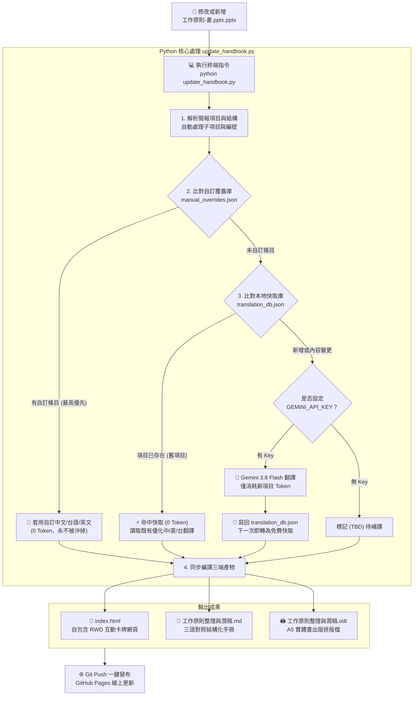

# 工作的管見 My Two Cents - From the Floor: My Two Cents on Practical Work Principles (投影片至手冊與網頁卡牌系統)

本專案是一個基於 Python 的自動化工作流，旨在讀取並解析作者過去整理的職場原則簡報檔（`.pptx`），將其自動轉化為結構清晰的三語對照 Markdown 手冊（`工作原則整理與潤稿.md`）與極具質感的互動式卡牌網頁應用程式（`index.html`）。

---

## 專案結構

- **輸入檔案**：
  - `工作原則-書.pptx.pptx`：簡報源檔案。未來您只要更新此投影片並重新執行腳本，手冊與網頁便會自動更新。
- **核心程式與資料庫**：
  - `update_handbook.py`：核心 Python 自動化工作流指令碼。負責解析投影片、比對快取資料庫、呼叫 API 翻譯（選用）並生成輸出。
  - `manual_overrides.json`：**👑 手動自訂翻譯覆蓋庫**。若您對特定項目的中/英/台翻譯有個人偏好的修訂，直接在此設定，優先權最高，絕不被 AI 或更新腳本覆蓋。
  - `translation_db.json`：全域三語快取資料庫。存有所有原則的高品質繁體中文、英文以及台語漢字翻譯，確保日常更新 0 Token。
- **輸出成果**：
  - `工作原則整理與潤稿.md`：結構化、文筆流暢的三語對照手冊（包含第一部分：20 條核心原則與六大章節；第二部分：452 條投影片逐條潤稿）。
  - `index.html`：自包含（Self-contained）的精美卡牌網頁應用程式。提供「核心原則」、「簡報卡牌」、「隨機抽卡」三種瀏覽視角，配有深淺色切換、即時搜尋、篩選、3D 翻牌動畫，以及**獨立欄位顯示開關（可分別切換隱藏/顯示簡報原文、原則標籤、中文、英文、台文，並自動記憶偏好）**。

---

## 網頁卡牌亮點功能

1. **獨立欄位顯示切換（Display Toggles）**：
   - 頂部設有獨立膠囊開關，可自由分別開啟或關閉：
     - 📝 **簡報原文**：作者目前書寫於投影片上的原始原則筆記。
     - 🏷️ **對照原則**：關聯的核心原則（原則 1~20）標籤徽章與跳轉按鈕。
     - 🇨🇳 **優化中文**：經商業語境潤飾的繁體中文說明。
     - 🇬🇧 **優化英文**：精煉道地的英文表達。
     - 🏮 **優化台文**：接地氣且富有民間智慧的台語漢字。
   - **快速情境**：提供「全部顯示」、「純三語」（隱藏原文，專注閱讀翻譯）、「純原文」（只讀簡報筆記）一鍵切換。
   - **自動記憶**：瀏覽器透過 `localStorage` 記住您的個人設定，重整或再次開啟依然維持個人化配置。
2. **三種檢視視角**：
   - **核心原則 (20)**：體系化的 20 大原則，配有章節分類與卡牌關聯索引。
   - **簡報卡牌 (458)**：逐條查閱投影片所有卡片，支援按投影片批次過濾。
   - **隨機抽卡**：模擬實體卡牌抽取，正面顯示原則、背面 3D 翻牌顯示三語對照，適合每日職場啟發或自我抽測。

---

## 運作原理

1. **簡報解析與結構化**：
   - 腳本會讀取 PPTX 內的所有文字方塊，提取帶有數字編號的項目。
   - **子項目判定法**：如果讀到編號突然大幅減小（如 Slide 8 編號 399 後方出現 1, 2, 3），腳本會自動將其判定為編號 399 的子項目並合併文字，維持手冊的層級結構。
   - **重複編號處理**：若簡報中存在相同的編號（如 Slide 1 的兩個 `17`、`18`），腳本會自動加上 `-1`、`-2` 後綴，確保每張卡牌有唯一的 Key。
2. **三語翻譯匹配與 API 整合**：
   - 腳本會先比對 `translation_db.json`。若原文內容完全匹配，則直接沿用現有的高品質翻譯。
   - 若您在簡報中**修改了舊原則**或**新增了原則**：
     - 若環境中偵測到 `GEMINI_API_KEY`，腳本會自動呼叫最新 Google Gemini 3.8 Flash API（`gemini-3.8-flash`），在數秒內生成符合語境的高品質優化中文、優化英文與地道台語漢字翻譯，並將新翻譯寫回資料庫快取，避免重複呼叫。
     - 若無 API 金鑰，腳本會產生 `[TBD]` 待翻譯標記，確保程式不崩潰。
3. **篇章核心金句 (☆ 項目) 的設計與呈現**：
   - 簡報 Slide 1 中以 `☆` 包裹的 53 則金句（例如：`☆利用工具，三觀五覆。☆`、`☆運動健身，定期捐血。☆`）屬於「篇章級的精神引導與心法」。
   - **優雅呈現方式**：
     - **網頁「核心原則」頁面**：金句不作為個別混雜卡牌，而是以獨立頂部橫幅（**Chapter Header Banner**）結合微光膠囊（Quote Pills）方式，優雅展示於六大篇章之首，提供讀者在閱讀該篇原則前的精神指引。
     - **書籍與手冊**：同步作為各篇開頭的精神宣言，確保手冊與出版書籍結構豐富且層次嚴整。

---

## 🔄 完整操作流程 (Operation Flow)

本系統採用「**投影片為本 ➔ 增量快取翻譯 ➔ 自動多端產出**」的自動化架構。日常維護時，您只需要修改投影片並執行一行指令即可完成全套更新：

### 流程圖解 (Flowchart)



> 💡 **文字版流程對照（若預覽器未啟用 Mermaid 渲染可參考此圖）**：
> ```text
> ［修改 PPTX 投影片］ ───> ［執行 python update_handbook.py］
>                                   │
>                 ┌─────────────────┴─────────────────┐
>                 ▼                                   ▼
>       【manual_overrides.json】             【未手動自訂之項目】
>                 │                                   │
>       👑 優先套用自訂中/台/英文                     ┌─────────┴─────────┐
>       (0 Token，永不覆蓋)                          ▼                   ▼
>                 │                         【命中既有快取】      【新增/修改未快取】
>                 │                           ⚡ 0 Token         🤖 Gemini 3.8 翻譯
>                 │                                │                    │
>                 │                                │           💾 寫回 translation_db
>                 │                                │                    │
>                 └─────────────────┬──────────────┴────────────────────┘
>                                   ▼
>                  同步生成 3 端成果 (無需伺服器)：
>                  ├── 📱 index.html (自包含卡牌網頁)
>                  ├── 📖 工作原則整理與潤稿.md (三語手冊)
>                  └── 🖨️ 工作原則整理與潤稿.odt (出版排版書)
>                                   │
>                                   ▼
>                  ［Git Push 上傳至 GitHub Pages 線上公開］
> ```

### ✍️ 手動修改自訂翻譯 (方式 3: Manual Overrides)

若您對特定簡報卡牌或核心原則的翻譯有更接地氣或專屬的修訂，只需開啟 [`manual_overrides.json`](file:///c:/Users/tu-hs/OneDrive/文件/2022_0308_MASA/2022-0708/Projects_antigravity/工作的管見-書/manual_overrides.json) 填入修訂：

```json
{
  "_README": "在此設定的文字權重最高，絕不會被 AI 或更新腳本覆蓋。",
  
  "12": {
    "mandarin": "工作要做，規矩也得兼顧。",
    "taiwanese": "代誌著做，規矩嘛著顧。"
  },
  
  "principle_1": {
    "title": "自訂原則 1 標題",
    "mandarin": "自訂核心原則中文說明..."
  }
}
```
- **支援單欄位覆蓋**：若只填 `"taiwanese"`，其餘中文與英文會自動沿用既有快取。
- **儲存即生效**：存檔後執行 `python update_handbook.py`，三端成果隨即換成您的版本！

### 日常維護 4 步驟

1. **修改簡報**：開啟 `工作原則-書.pptx.pptx`，直接修改舊原則內容，或在投影片最後加上新編號原則（如 `459. ...`）後存檔。
2. **一鍵編譯**：在終端機執行：
   ```bash
   python update_handbook.py
   ```
3. **本地檢視**：雙擊 `index.html` 立即預覽更新後的卡牌，並可檢查 `工作原則整理與潤稿.md`。
4. **推播上線**：確認無誤後，推送至 GitHub 即刻更新線上網站：
   ```bash
   git add .
   git commit -m "update: 更新原則與卡牌資料"
   git push
   ```

---

## 快速開始

### 1. 安裝依賴套件

本專案使用 Python 3 運作。請先在終端機中安裝需要的套件：

```bash
pip install python-pptx google-genai
```

*(註：如果您已經安裝了這些套件，可以直接跳過。)*

### 2. 執行工作流

直接執行以下指令，即可解析簡報並更新手冊與網頁：

```bash
python update_handbook.py
```

### 3. 開啟網頁卡牌

執行完成後，直接雙擊或用瀏覽器開啟 `index.html` 即可使用。此網頁是完全自包含的，無需配置任何伺服器即可在本地離線流暢運行。

---

## 部署至 GitHub Pages (免費公開線上版)

本專案 `index.html` 採自包含架構，且專案已內建 `.nojekyll` 與排除 API 金鑰的 `.gitignore` 安全設定，只要 3 步即可將卡牌系統上線為全球可瀏覽的個人網站：

### 步驟 1：初始化本地 Git 並提交
在專案根目錄執行：
```bash
git init
git add .
git commit -m "feat: 工作的管見三語對照卡牌系統與 GitHub Pages 設定"
```

### 步驟 2：在 GitHub 建立儲存庫並推送
1. 登入 [GitHub](https://github.com/) 並點擊右上角「+」-> **New repository**。
2. 輸入倉庫名稱（例如 `principles-cards`），設為 **Public**，點擊 **Create repository**。
3. 依照 GitHub 提示將本地倉庫連結並推送到遠端：
```bash
git branch -M main
git remote add origin https://github.com/SinLiongToo/my_priciple_card.git
git push -u origin main
```

### 步驟 3：啟用 GitHub Pages
1. 進入您剛建立的 GitHub 倉庫頁面，點選上方的 **Settings**（設定）。
2. 在左側選單點選 **Pages**。
3. 在 **Build and deployment** 下方的 **Source** 選擇 **Deploy from a branch**。
4. Branch 選擇 `main`，資料夾保持預設 `/ (root)`，點擊 **Save**。
5. 等候約 1~2 分鐘，上方即會出現專屬公開網址：
   `https://sinliongtoo.github.io/my_priciple_card/`
   *(您可以將此網址加入手機主畫面，隨時隨地像 App 一樣抽卡閱讀！)*

---

## 💡 關於 Gemini API 金鑰、計費與 Token 消耗機制

### Q：若未來新加原則項目，舊的項目還會重複消耗 Token 嗎？

**答：完全不會！消耗為 0 Token。**

本系統在底層設計了嚴格的「**快取優先 (Cache-First) 增量翻譯機制**」：

1. **舊項目 0 Token**：專案中的 `translation_db.json` 已經完整儲存了既有所有原則的優化中文、優化英文與台語漢字翻譯。每次執行更新腳本時，程式會逐條比對簡報原文與快取資料庫。**只要舊項目的文字沒有變動，直接 100% 命中快取，完全不向 Google 發出任何 API 請求，Token 消耗精確為 0**。
2. **僅新項目/修改項目消耗 Token**：只有當您在簡報中「**新增了全新編號的項目**」或「**修改了既有項目的英文內容**」時，系統才會將這些「未匹配」的項目交給最新的 Gemini 3.8 Flash 翻譯。
3. **即時寫回快取**：新項目一旦翻譯完成，會**立即自動寫入** `translation_db.json` 保存。當您下次再次執行腳本時，這些新項目也已經是既有快取，以後也不會再重複消耗任何 Token！

| 操作情境 | 是否呼叫 Gemini API？ | Token 消耗 | 說明 |
| :--- | :---: | :---: | :--- |
| **未修改投影片，直接重跑腳本** | ❌ 否 | **0 Token** | 全部 458 條原則直接命中本地快取 |
| **修改 PPTX 格式、投影片順序** | ❌ 否 | **0 Token** | 原文文字無變化，直接沿用現有翻譯 |
| **新增 1 條新原則 (如 No. 459)** | 🤖 是 (僅 1 條) | 極低 (~150 Tokens) | 舊 458 條 0 Token，僅新 1 條呼叫 API，並存入快取 |
| **修改 1 條舊原則的英文內容** | 🤖 是 (僅該條) | 極低 (~150 Tokens) | 僅針對文字變更的那 1 條重譯，其餘 457 條 0 Token |

---

### Google AI Studio 申請與計費說明

本工作流的 API 翻譯功能已升級至 **Google 最新旗艦輕量模型 Gemini 3.8 Flash (`gemini-3.8-flash`)**（亦支援透過環境變數 `GEMINI_MODEL` 自訂模型）。您可以前往 [Google AI Studio 官網](https://aistudio.google.com/) 申請免費的 API 金鑰：

- **免費額度 (Free Tier)**：
  - Gemini Flash 系列提供了慷慨的免費 API 額度（每分鐘 15 次請求，每天最高 1,500 次請求）。
  - 對於日常增補原則（一次更新數條），**在免費額度內完全免費，不需要綁定信用卡或付費**。
- **付費模式 (Pay-as-you-go，若有啟用)**：
  - 若帳號綁定 Google Cloud Billing，Gemini 3.8 Flash 計費極低，日常維護翻譯 10 條原則僅約幾微錢美金，成本微乎其微。

---

## 📝 更新紀錄與品質里程碑 (Changelog)

### 2026-09-13：雙語書名與副標題對齊
- **🌐 頂部標題新增英文書名與副標題**：
  - 主標題新增英文對應 **「My Two Cents」**（對齊「工作的管見」之意涵）。
  - 副標題新增 **「From the Floor: My Two Cents on Practical Work Principles」**，象徵來自第一線現場的實務工作心法。
  - 同步更新至網頁卡牌頂端橫幅（`index.html`）、Markdown 手冊（`工作原則整理與潤稿.md`）、出版書籍排版封面（`工作原則整理與潤稿.odt`）與專案說明文件（`README.md`）。

### 2026-09-12：全書台語文全面地道精修 (100% 完成) & 網頁時間戳記升級
- **🏮 全書 20 大核心原則 + 458 條簡報卡牌台語文 100% 地道化（母語氣口）**：
  - 徹底排除過去依賴字面直譯的生硬華語官腔（例如「並設置」、「且講明」、「軟實力」、「建立儀式感」、「進行壓力測試」等）。
  - 全書 478 則條目（20 核心原則 + 458 簡報卡牌）全數改採標準教育部推薦台語漢字，注入沉穩、凝練且蘊含職場處世智慧的民間俗諺語感（如「放冗」、「做主裁」、「手尾清氣」、「摸清楚」、「大白話」、「摸透身價」、「食苦當作食補」、「尻川坐予在」、「敢試敢做」等）。
- **🕒 網頁動態更新時間戳記**：
  - 在互動網頁（`index.html`）頂端標題旁新增 `🕒 最後更新：YYYY-MM-DD HH:MM` 專屬膠囊徽章，並於頁尾同步標示最新建置時間。
  - `update_handbook.py` 於每次重新生成時自動動態注入系統當前時間，無須手動維護。
- **🤖 升級至 Gemini 3.8 Flash**：
  - API 預設模型升級至 Google 最新旗艦輕量模型 `gemini-3.8-flash`。
- **👑 手動自訂覆蓋架構 (`manual_overrides.json`)**：
  - 建立手動自訂優先機制，只要在此檔案中指定的卡牌或原則，權重永遠高於資料庫快取與 AI API。
- **☆ 53 則篇章引導金句橫幅展示**：
  - 簡報第 1 頁之 53 則金句獨立展示於網頁六大篇章之頂部橫幅（Chapter Banner）與出版書籍篇章頁。

